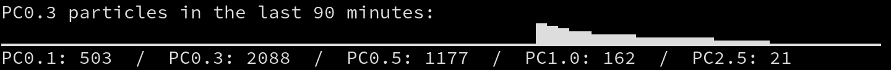

# Particles
Particles is a small client/server command line program to query air quality 
using a [Piera Systems](https://pierasystems.com/) air quality sensor.

With a few modifications it should work on most other air quality sensor types.

# Setup
There are two main.go files, one in the "client" directory and one in the "server"
directory. Modify the URL, PORT, step size and Device Path settings at the beginning
 of each file.

# Building
On the server:
  $ cd server 
  $ go build -o particle_server *.go

  Copy the executable to your server, and run.

On the client:
  cd client
  go build -o particles *.go
